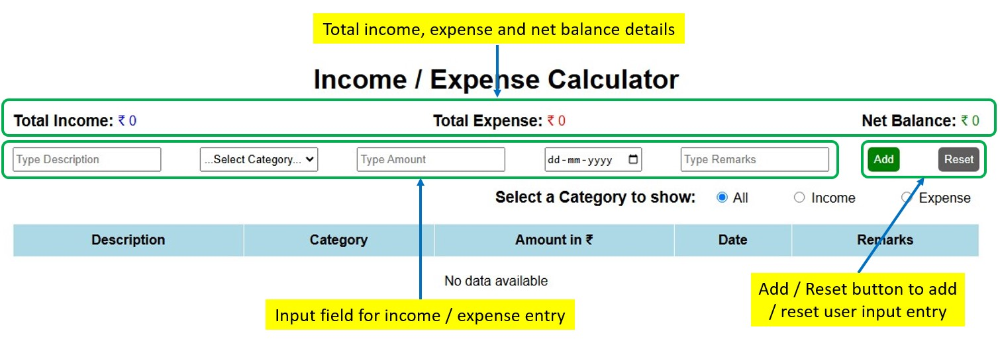

# Income / Expense calculator Application using HTML, CSS, and JavaScript

## Introduction

This is a simple Income / Expense calculator application using HTML, CSS, and JavaScript. And it is an intuitive tool designed to help users to track and manage their income and expenses. This application allows users to easily record and categorize their financial transactions, providing a clear and concise overview of their financial situation. CRUD (Create, Read, Update, Delete) operations used in this application to manage the data. Browser's local storage used to store the income / expense entries, so they will persist even after the browser is closed.

## Features:

- Income and Expense Tracking: Record and categorize your income and expenses with ease.
- Transaction History: View a detailed history of all your transactions, including date, amount, and category.
- This application allows users to:
  - add / create a new income / expense entry.
  - read all the income / expense entries in table format.
  - edit / update the entries if wrond data provided, and
  - delete income / expense details, providing an overview of their financial status.
  - User can read the income and expense entries separately by using filter option in case of more entries are there.
  - User can read the total income, expense and net balance details.

## Installation:

- Open the URL - `.` in your browser to load the application.

## How to use:

- To add a new income / expense entry, type the details in the input field and click the `Add` button.
- Click reset button to reset a input field if wrong data provided.
- To edit an entry,
  - click on the `edit` button available on the respective table row,
  - respective entry details will be populated in the input field,
  - make the changes, and press the `Update` button available in the input field area,
  - if don't want to change the entry, click `Cancel` button available in the input field area.
- To delete a income / expense entry,
  - click on the `Delete` button available on the respective table row,
  - alert message will popup once you click `Delete` button,
  - click ok if you want to delete else click cancel.

## Demo

###

